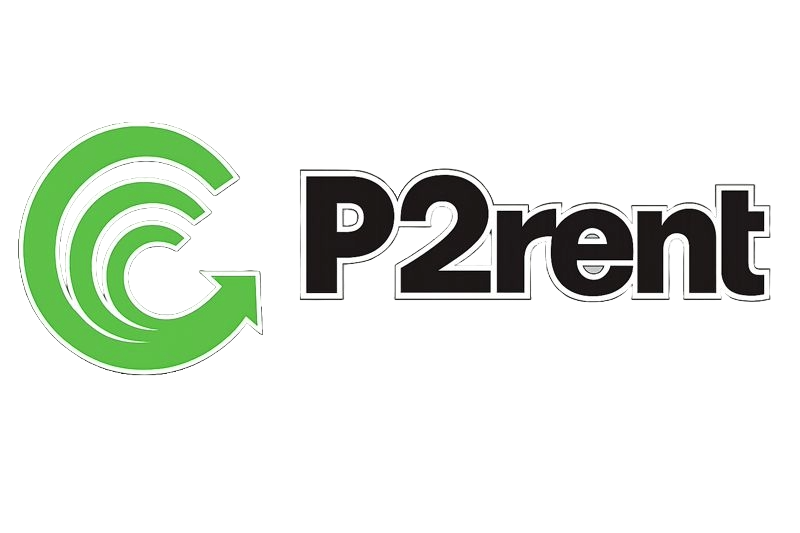

# p2rent



[](https://www.rust-lang.org/)
[](https://www.rfc-editor.org/rfc/rfc9000.html)
[](LICENSE)

Peer-to-peer file transfer over QUIC. Files are split into Blake3-verified chunks; peers exchange data over TLS 1.3 with Ed25519 handshake identity.

---

## Contents

- [p2rent](#p2rent)
  - [Contents](#contents)
  - [Features](#features)
  - [Requirements](#requirements)
  - [Install](#install)
    - [From source (Cargo)](#from-source-cargo)
    - [Nix](#nix)
  - [Usage](#usage)
  - [Manifests and the wire protocol](#manifests-and-the-wire-protocol)
  - [CLI](#cli)
  - [Project layout](#project-layout)
  - [Security model](#security-model)
  - [Development](#development)
  - [Roadmap](#roadmap)
  - [Contributing](#contributing)
  - [License](#license)

---

## Features

- **QUIC (Quinn)** — Multiplexed streams, built-in TLS 1.3.
- **Chunking & integrity** — Configurable chunk size; Blake3 per chunk; hashes checked on fetch.
- **Identity** — Ed25519 keypairs, signed handshake with replay window.
- **Wire format** — Binary messages (bincode), size-capped reads.
- **Manifests** — Small metadata files on disk (see below).
- **CLI** — `share`, `serve`, `fetch` with optional parallel directory preparation (Rayon).

---

## Requirements

- **Rust** 1.85 or newer (2024 edition)
- **Cargo** (for building from source)

Optional: **Nix** with flakes enabled, for reproducible builds and dev shells.

---

## Install

### From source (Cargo)

```bash
git clone https://github.com/yourusername/p2rent.git
cd p2rent
cargo build --release
# Binary: target/release/p2rent
```

### Nix

```bash
nix run github:yourusername/p2rent
nix profile install github:yourusername/p2rent   # optional: install into profile
nix develop                                       # dev shell with toolchain
```

Replace `yourusername/p2rent` with your fork or organization.

---

## Usage

**1. Prepare content (chunk + manifest + store)**

```bash
p2rent share path/to/file.zip
p2rent share ./directory --parallel
p2rent share large.iso --chunk-size 4194304
```

**2. Serve chunks**

```bash
p2rent serve
p2rent serve --addr 0.0.0.0:5000
```

**3. Fetch using the manifest path**

```bash
p2rent fetch --addr 192.168.1.10:5000 --manifest manifests/file.manifest.json
p2rent fetch --addr peer:5000 --manifest ./file.manifest.json --out ./out.zip
```

Flow in short: **share** writes chunks and a manifest; **serve** exposes chunks; **fetch** reads the manifest locally, pulls chunks over QUIC, verifies hashes, writes the output file.

---

## Manifests and the wire protocol

| Layer | Format | Role |
| ----- | ------ | ---- |
| **On-disk manifest** | JSON (`.manifest.json`) | Human-readable metadata: filename, size, chunk size, ordered Blake3 digests. Shared out-of-band like a small “torrent descriptor.” |
| **Peer messages over QUIC** | **Bincode** (binary) | `RequestChunk`, `Chunk` payloads, etc. Not JSON — avoids huge encoding overhead for megabyte-scale chunk bodies. |

---

## CLI

Run `p2rent --help` and `p2rent <command> --help` for the full, up-to-date interface.

| Command | Purpose |
| ------- | ------- |
| `share <PATH>` | Chunk files, write manifest + chunk store |
| `serve` | Listen for QUIC peers and serve chunks |
| `fetch` | Connect to a peer and assemble a file from a manifest |

Common flags: `--addr`, `--manifest`, `--out`, `--stem`, `--chunk-size`, `--storage-dir`, `--manifest-dir`, `--parallel`.

---

## Project layout

| Path | Responsibility |
| ---- | ---------------- |
| `src/main.rs` | CLI entrypoint |
| `src/chunk.rs` | Split / combine files |
| `src/crypto.rs` | Keys, signing, node id |
| `src/manifest.rs` | Read/write manifest files |
| `src/storage.rs` | Chunk files on disk |
| `src/net/protocol.rs` | Message types (serialized with bincode on the wire) |
| `src/net/quic.rs` | QUIC client/server |
| `tests/` | Integration tests |

---

## Security model

- **Transport:** QUIC over TLS 1.3 (self-signed server cert today; client does not pin that cert to a public CA).
- **Handshake:** Ed25519 signatures over a canonical payload; timestamps limited to a replay window.
- **Content:** Chunk Blake3 hashes in the manifest are checked after download.
- **Reads:** Incoming application messages are bounded (e.g. 16 MB cap) to limit memory use.
- **Keys:** Default path `~/.config/p2rent/keys.json` with restrictive permissions where supported.

This is suitable for controlled or LAN-style sharing; it is not a full public-internet anonymity or trust model.

---

## Development

```bash
cargo fmt
cargo clippy --all-targets -- -D warnings
cargo test
```

CI runs format, clippy, tests, and builds on push/PR; tagged releases publish cross-compiled binaries (see `.github/workflows/`).

---

## Roadmap

- Peer discovery (e.g. DHT)
- Multi-source / swarm downloads
- NAT traversal
- Rate limiting and resumable transfers
- Selective files from directory manifests

---

## Contributing

Issues and pull requests are welcome. Please run `cargo fmt`, `cargo clippy`, and `cargo test` before submitting.

---

## License

This project is licensed under the MIT License — see [LICENSE](LICENSE).
